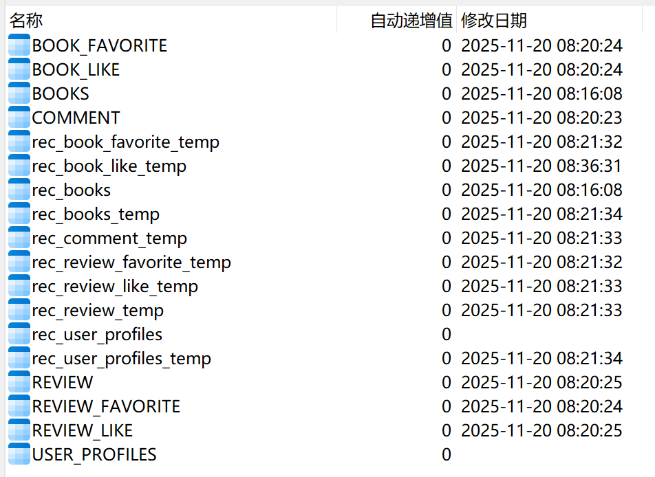

- kafka 的 topics 会自动创建，但是需要第一条信息。

- book_db 的也要手动导入，代码的不知道为什么执行不起来。

- 数据库的表自动创建有一点问题，需要手动创建用户行为 book_managerment 的表
```sql
-- 1. 图书收藏表 (BOOK_FAVORITE)
CREATE TABLE IF NOT EXISTS BOOK_FAVORITE (
    favorite_id CHAR(16) PRIMARY KEY,
    user_id VARCHAR(20) NOT NULL,
    book_id CHAR(255) NOT NULL,
    add_time DATETIME NOT NULL DEFAULT CURRENT_TIMESTAMP,
    UNIQUE KEY _user_book_favorite_uc (user_id, book_id)  -- 联合唯一约束
) ENGINE=InnoDB DEFAULT CHARSET=utf8mb4;

-- 2. 书评收藏表 (REVIEW_FAVORITE)
CREATE TABLE IF NOT EXISTS REVIEW_FAVORITE (
    favorite_id CHAR(16) PRIMARY KEY,
    user_id VARCHAR(20) NOT NULL,
    review_id CHAR(255) NOT NULL,
    add_time DATETIME NOT NULL DEFAULT CURRENT_TIMESTAMP,
    UNIQUE KEY _user_review_favorite_uc (user_id, review_id)  -- 联合唯一约束
) ENGINE=InnoDB DEFAULT CHARSET=utf8mb4;

-- 3. 图书点赞表 (BOOK_LIKE)
CREATE TABLE IF NOT EXISTS BOOK_LIKE (
    like_id CHAR(16) PRIMARY KEY,
    user_id VARCHAR(20) NOT NULL,
    book_id CHAR(255) NOT NULL,
    like_time DATETIME NOT NULL DEFAULT CURRENT_TIMESTAMP,
    UNIQUE KEY _user_book_like_uc (user_id, book_id)  -- 联合唯一约束
) ENGINE=InnoDB DEFAULT CHARSET=utf8mb4;

-- 4. 书评点赞表 (REVIEW_LIKE)
CREATE TABLE IF NOT EXISTS REVIEW_LIKE (
    like_id CHAR(16) PRIMARY KEY,
    user_id VARCHAR(20) NOT NULL,
    review_id CHAR(255) NOT NULL,
    like_time DATETIME NOT NULL DEFAULT CURRENT_TIMESTAMP,
    UNIQUE KEY _user_review_like_uc (user_id, review_id)  -- 联合唯一约束
) ENGINE=InnoDB DEFAULT CHARSET=utf8mb4;

-- 5. 书评表 (REVIEW)
CREATE TABLE IF NOT EXISTS REVIEW (
    review_id CHAR(16) PRIMARY KEY,
    book_id CHAR(255) NOT NULL,
    user_id VARCHAR(20) NOT NULL,
    content TEXT NOT NULL,
    rating FLOAT(2,1) NOT NULL,  -- 总长度 2 位，小数 1 位（如 4.5）
    like_count INT DEFAULT 0,
    post_time DATETIME NOT NULL DEFAULT CURRENT_TIMESTAMP,
    status TINYINT DEFAULT 0  -- 0:正常, 1:待审核, 2:已删除（模型中是 SmallInteger，对应 MySQL TINYINT）
) ENGINE=InnoDB DEFAULT CHARSET=utf8mb4;

-- 6. 评论表 (COMMENT)（对书评的评论）
CREATE TABLE IF NOT EXISTS COMMENT (
    comment_id CHAR(16) PRIMARY KEY,
    review_id CHAR(16) NOT NULL,  -- 关联 REVIEW 表的 review_id（长度 16）
    user_id VARCHAR(20) NOT NULL,
    content TEXT NOT NULL,
    like_count INT DEFAULT 0,
    comment_time DATETIME NOT NULL DEFAULT CURRENT_TIMESTAMP,
    -- 可选：添加外键约束（删除书评时级联删除评论，与模型中 delete_review 逻辑一致）
    CONSTRAINT fk_comment_review FOREIGN KEY (review_id) REFERENCES REVIEW (review_id) ON DELETE CASCADE
) ENGINE=InnoDB DEFAULT CHARSET=utf8mb4;
```

- 数据同步到 recommdation 数据库中，需要手动复制创建表，全部表如下



- clickhouse 也需要手动创建，详情见 clickhouse_initialization.md 的内容